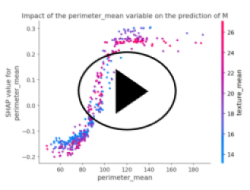
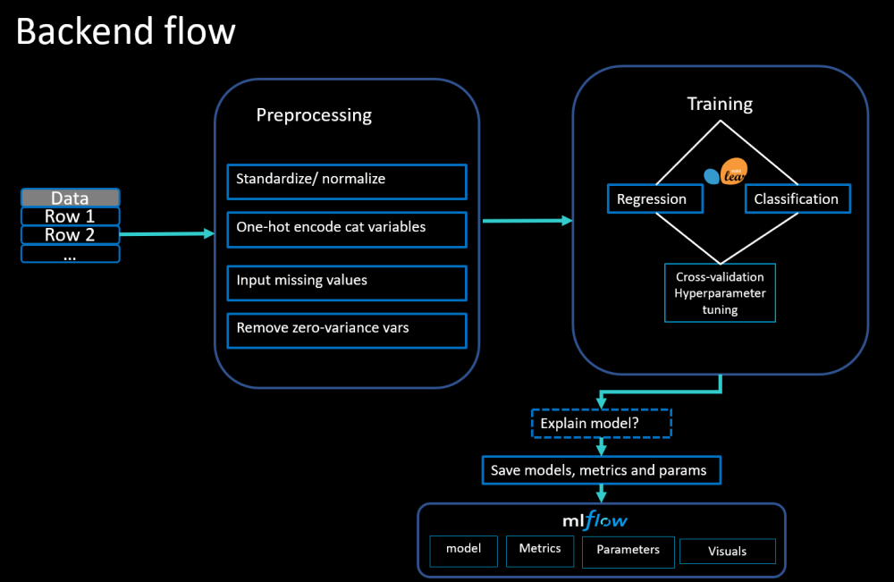

# ASSESS (Automated SignalS Evaluation Service System)

ASSESS allows you to assess the signal in your dataset, identify the important variables and deploy your model in seconds.

## Demo

[](
https://user-images.githubusercontent.com/34417947/113521205-429bb380-9598-11eb-8508-48edd8b7127b.mp4)





## Features

-  Automated signal assessment in datasets
-  Feature importance identification
-  Model explainability with SHAP
-  Quick model deployment as REST API
-  MLflow integration for experiment tracking
-  Interactive Streamlit web interface
-  GCP deployment ready


## Installation

### Prerequisites
- Python 3.7 or higher
- pip package manager

### Setup

Clone the repository:
```bash
git clone https://github.com/P-mir/Assess.git
cd Assess
```

Install dependencies:
```bash
pip install -r requirements.txt
```

## Usage

### Web application

```bash
streamlit run src/app.py
```

## Sphinx documentation

https://assesss.readthedocs.io/en/latest/

## Command line interface


### Training a model

```bash
python src/train.py --target "label" --path "../data/iris2.csv" --explainmodel
```

Arguments:
- `--target`: The name of the target variable
- `--path`: Path to the dataset csv file
- `--explainmodel`: Optional argument to store plots explaining the model's decisions

### Monitoring the model via the MLflow UI

Place yourself in the ASSESS/src directory then:

```bash
mlflow ui
```

### Generate predictions

```bash
python src/predict.py --path ../data/iris2.csv
```

### Deploy the model as a local REST API

From the ASSESS directory:

```bash
mlflow models serve -m "src\mlruns\0\<model id>\artifacts\sk_model" -p 1234
```

### HTTP query from a Python script

```python
import requests

# Define X as the pandas dataframe containing the observations
http_data = X.to_json(orient='split')
host = '127.0.0.1'
port = '1234'
url = f'http://{host}:{port}/invocations'
headers = {'Content-Type': 'application/json'}
r = requests.post(url=url, headers=headers, data=http_data)
print(r.text)
```
